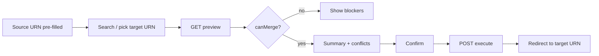

# Frontend prompt: Admin URN merge UI

**Give this entire file to the admin portal team** (`greenpro-portals/admin` or equivalent, port `3004`).

**Depends on backend:** `docs/BACKEND-URN-MERGE-PROMPT.md` — implement APIs before wiring UI.

**User story:** After a URN is **certified**, admin can merge it into an **existing certified URN** (same category). All certified **products (EOIs)** and related data should appear under the **target** URN. Different category → not allowed.

---

## 1. Where this lives in the admin app

Suggested placement (adjust to your IA):

| Location | Purpose |
|----------|---------|
| Certified product / URN detail page | Primary entry: **“Merge into another URN”** |
| Or certified products list | Bulk action (optional v2) |

Route example:

```
/admin/products/certified/[urnNo]/merge
```

Only show action when:

- URN has at least one **certified** EOI (`productStatus === 2`)
- User has permission `products:update` (or `products:urn_merge`)

Hide when URN is in **renewal** workflow (`urnStatus` 12–17).

---

## 2. API base URL

Use the **same** HTTP client as other admin product APIs:

```env
NEXT_PUBLIC_API_URL=http://localhost:3000
```

```ts
const API_BASE = process.env.NEXT_PUBLIC_API_URL?.replace(/\/$/, '') ?? 'http://localhost:3000';
```

Do **not** call Next.js page paths as APIs (see `docs/admin-renew-quick-view-frontend-fix-prompt.md`).

---

## 3. API integration

### 3.1 Preview

```
GET ${API_BASE}/api/admin/products/urn-merge/preview?sourceUrnNo={source}&targetUrnNo={target}
Authorization: Bearer <adminJwt>
```

Call when user selects **target URN** (debounced) or on **Review merge** step.

### 3.2 Execute

```
POST ${API_BASE}/api/admin/products/urn-merge
Authorization: Bearer <adminJwt>
Content-Type: application/json

{
  "sourceUrnNo": "<current urn>",
  "targetUrnNo": "<selected target>",
  "moveAllCertifiedEois": true,
  "urnLevelStrategy": "fill_gaps_keep_target"
}
```

---

## 4. UX flow (recommended wizard)



### Step 1 — Source URN (read-only)

- Opened from certified URN context; show `urnNo`, category name, manufacturer, list of **certified EOIs** (name, EOI no., `productId`).
- Short copy: “These certified products will move to the target URN.”

### Step 2 — Select target URN

- Search certified URNs: same **category** filter on client until backend preview runs.
- Good filters: same manufacturer/vendor, `productStatus = 2`, exclude current source `urnNo`.
- Use existing certified list/search API if available; otherwise dedicated lookup endpoint when backend adds one.

**Client-side pre-check (optional):** disable targets whose category label ≠ source category (still rely on preview API).

### Step 3 — Preview panel

Render `preview` response:

| Section | Data |
|---------|------|
| Status | `canMerge` banner (green / red) |
| Blockers | `blockers[]` — bullet list, no confirm button if any hard blocker |
| EOIs to move | `eoisToMove[]` table |
| URN-level conflicts | `urnLevelConflicts[]` — e.g. “Manufacturing: target kept, source data not moved” |
| URN-level moves | `urnLevelMoves[]` — sections that will be re-keyed |

### Step 4 — Confirm

- Checkbox: “I understand certified EOIs will be moved to {targetUrnNo}.”
- Primary button: **Merge URN** → `POST` execute
- Loading state; disable double submit

### Step 5 — Success

- Toast: “Merged {n} products into {targetUrnNo}.”
- Navigate to target URN certified detail or renew shell:
  - `GET ${API_BASE}/api/admin/products/details/{targetUrnNo}`
- Do not leave user on source URN as if it were still the active registration (optional banner on source: “Merged into {target}” if backend exposes history).

---

## 5. TypeScript types (align with backend)

```ts
export type UrnMergeBlocker = {
  code: string;
  message: string;
};

export type UrnMergeEoiRow = {
  productId: number;
  eoiNo: string;
  productName: string;
  productStatus: number;
};

export type UrnMergeSectionConflict = {
  collection: string;
  sourceHasData: boolean;
  targetHasData: boolean;
  action: string;
};

export type UrnMergePreview = {
  success: boolean;
  canMerge: boolean;
  sourceUrnNo: string;
  targetUrnNo: string;
  categoryId?: string;
  categoryName?: string;
  blockers: UrnMergeBlocker[];
  eoisToMove: UrnMergeEoiRow[];
  urnLevelConflicts: UrnMergeSectionConflict[];
  urnLevelMoves: UrnMergeSectionConflict[];
  warnings?: string[];
};

export type UrnMergeExecuteResult = {
  success: boolean;
  mergeId?: string;
  sourceUrnNo: string;
  targetUrnNo: string;
  movedProductIds: number[];
  movedEoiNos: string[];
  urnSectionsRekeyed?: string[];
  urnSectionsSkipped?: string[];
};
```

---

## 6. Service module (suggested)

```
admin/lib/products/urnMerge.service.ts
  fetchUrnMergePreview(sourceUrnNo, targetUrnNo)
  executeUrnMerge(payload)
```

Use shared axios/fetch wrapper with admin JWT (same as `patchRenewTestValidity`, certified edit, etc.).

---

## 7. Error handling

| HTTP | UI |
|------|-----|
| 400 | Show `message` / validation errors from API |
| 401 | Redirect login |
| 403 | “You don’t have permission to merge URNs” |
| 409 | Show conflict detail (duplicate EOI, renewal in progress) |
| Network | “Cannot reach API — check NEXT_PUBLIC_API_URL” |

If preview returns `canMerge: false`, treat as **business rejection**, not a network error.

---

## 8. Visibility rules (mirror backend)

Do **not** show merge entry when:

| Condition | Reason |
|-----------|--------|
| No certified EOIs on source | Nothing to move |
| `urnStatus` 12–17 | Active renewal |
| User lacks `products:update` | Auth |

Show **warning** (still allow preview) when:

- `urnLevelConflicts.length > 0` — explain target wins for process tabs

---

## 9. Target URN picker UX tips

- Show **category name** prominently on both sides; highlight match/mismatch before preview.
- Show **valid till** / certified date on target options (admin picks the “main” URN).
- Exclude **source** from target dropdown.
- Prefer targets under same **manufacturer** (fewer backend rejections).

If no list API exists yet, ask backend for:

```
GET /api/admin/products/certified-urns?categoryId=&manufacturerId=&q=
```

(minimal: `urnNo`, `categoryName`, `eoiCount`, `manufacturerName`)

---

## 10. Acceptance checklist

- [ ] Merge action only on certified URN context
- [ ] Preview called against `localhost:3000` (not `3004` page URL)
- [ ] `canMerge: false` shows blockers; confirm disabled
- [ ] `canMerge: true` shows EOI table + conflicts
- [ ] Successful merge redirects to **target** URN details
- [ ] Target details shows **combined** EOIs (source + existing)
- [ ] Renewal URN (`urnStatus` 12–17) does not show merge action
- [ ] Double-click merge does not double POST

---

## 11. Copy (admin-facing)

| Element | Text |
|---------|------|
| Page title | Merge into existing URN |
| Description | Move all certified products from this URN into another URN in the **same category**. Process data already saved on the target URN is kept when both URNs have the same section. |
| Blocker | Cannot merge: categories must match. |
| Conflict note | Some process sections exist on both URNs. The target URN’s data will be kept. |
| Success | {n} product(s) merged into {targetUrnNo}. |

---

## 12. Related docs

| Doc | Topic |
|-----|--------|
| `docs/BACKEND-URN-MERGE-PROMPT.md` | API + data rules |
| `docs/admin-certification-products-frontend-prompt.md` | Certified products / `productId` |
| `docs/renew-details-api-frontend-fix-prompt.md` | API base URL pitfalls |
| `docs/admin-renew-quick-view-frontend-fix-prompt.md` | `NEXT_PUBLIC_API_URL` |

---

## 13. Out of scope (frontend v1)

- Vendor portal merge
- Partial EOI selection UI (backend supports `productIds[]`; optional checkbox list in v2)
- Merge history admin page (until backend exposes `GET urn-merges`)
