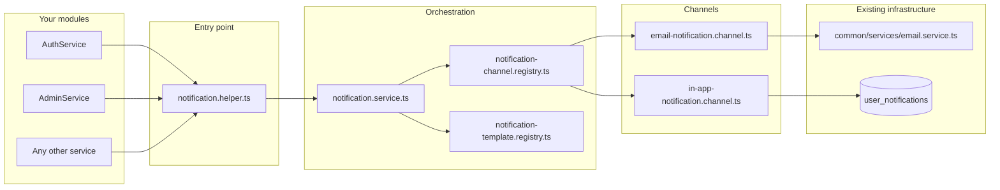

# Notification System — Flow & File Guide

This document explains **how a notification travels through the app** and **which file is responsible for what**.

> **Rule for feature modules:** inject `NotificationHelper` only. Do **not** call `EmailService` directly for user-facing notifications.

---

## 1. Big picture



**Two collections (do not confuse them):**

| Collection | Schema file | Purpose |
|------------|-------------|---------|
| `user_notifications` | `notifications/schemas/user-notification.schema.ts` | Per-user in-app alerts (bell icon, vendor portal) |
| `notifications` | `common/schemas/notification.schema.ts` | Admin panel system feed (events, newsletter, etc.) — **legacy, not part of this helper** |

---

## 2. End-to-end flow (when you call `send`)

Example from any service:

```typescript
await this.notificationHelper.send({
  type: ['email', 'in_app'],
  template: 'PRODUCT_APPROVED',
  userId: user.id,
  email: user.email,
  payload: { productName: 'ABC', approvedBy: 'Admin' },
});
```

### Step-by-step

| Step | What happens | File |
|------|----------------|------|
| 1 | Your module calls the facade | `notification.helper.ts` |
| 2 | Helper forwards to orchestrator (or queues background work) | `notification.service.ts` |
| 3 | Service validates template + recipients + channel list | `notification.service.ts` |
| 4 | Service loads template definition | `notification-template.registry.ts` ← reads `notification-templates.ts` |
| 5 | Service builds recipient list (`userId`, `userIds`, `email`, `emails`) | `notification.service.ts` |
| 6 | For each recipient × each channel, service gets handler | `notification-channel.registry.ts` |
| 7a | **Email channel:** checks `recipient.email`, resolves subject/body, sends SMTP | `email-notification.channel.ts` → `email.service.ts` |
| 7b | **In-app channel:** checks `recipient.userId`, inserts DB row | `in-app-notification.channel.ts` → `user-notification.schema.ts` |
| 8 | Each channel returns success/failure; other channels still run | `notification.service.ts` (failure isolation) |
| 9 | Aggregated result returned to caller | `notification.service.ts` → `notification.helper.ts` |

### Background send (`sendInBackground`)

Same flow as above, but step 1 uses `notificationHelper.sendInBackground()` → service runs async and **logs errors without throwing** to the HTTP handler. Suitable for password reset, non-critical mail.

---

## 3. File reference — what each file does

### Entry & wiring

| File | Role |
|------|------|
| `notifications.module.ts` | Registers all providers, marks module `@Global()`, exports `NotificationHelper`. Wired in `app.module.ts`. |
| `notification.helper.ts` | **What you inject in feature modules.** Thin API: `send()`, `sendInBackground()`, `sendToMany()`, `sendToRoles()` (stub). |
| `notification.service.ts` | **Brain:** validates requests, resolves recipients, loops channels, collects results, isolates failures. |

### Types & contracts

| File | Role |
|------|------|
| `interfaces/notification.types.ts` | Enums: `NotificationChannel`, `NotificationTemplateCode`. Types: `ChannelDeliveryResult`, `NotificationSendResult`, `NotificationRecipient`. |
| `interfaces/send-notification-request.interface.ts` | Shape of the object you pass to `send()` (`type`, `template`, `userId`, `payload`, etc.). |
| `interfaces/notification-channel.interface.ts` | Contract every channel must implement: `supports()`, `send()`. |
| `constants/notification.constants.ts` | Nest DI token `NOTIFICATION_CHANNEL_HANDLERS` for registering channel classes. |

### Templates

| File | Role |
|------|------|
| `templates/notification-templates.ts` | **Source of truth** for template copy (subject, HTML, in-app title/content). Uses `{{variable}}` placeholders. |
| `templates/notification-template.registry.ts` | Loads template by code, runs interpolation, returns email/in-app content. |
| `templates/notification-template.util.ts` | `interpolateTemplate()` — replaces `{{key}}` with payload values. |

### Channels (delivery)

| File | Role |
|------|------|
| `channels/notification-channel.registry.ts` | Map `email` / `in_app` → handler instance. Lists implemented channels. |
| `channels/email-notification.channel.ts` | Email delivery. Reuses `EmailService` methods for `USER_CREATED` / `PASSWORD_RESET`; generic templates use `sendEmail()`. |
| `channels/in-app-notification.channel.ts` | Creates rows in `user_notifications` via Mongoose; assigns numeric `id` via `SequenceHelper`. |
| `channels/future-channels.placeholder.ts` | Documentation only — how to add SMS / WhatsApp / Push later. |

### Database

| File | Role |
|------|------|
| `schemas/user-notification.schema.ts` | Mongoose model for in-app notifications (`user_id`, `title`, `content`, `seen`, etc.). |

### Related files (outside `src/notifications/`)

| File | Role |
|------|------|
| `common/services/email.service.ts` | SMTP / nodemailer — **transport only**. Called by email channel, not by feature modules. |
| `product-registration/helpers/sequence.helper.ts` | `getUserNotificationId()` — auto-increment id for in-app rows. |
| `common/schemas/notification.schema.ts` | **Separate** admin system notifications (not user in-app). |
| `auth/auth.service.ts` | **Example migration** — registration & password reset use `NotificationHelper`. |

---

## 4. Channel behavior (quick reference)

### Email (`email`)

- **Needs:** `email` on the request (or on recipient).
- **Skips if:** no email.
- **Templates with special HTML:** `USER_CREATED`, `PASSWORD_RESET` use existing `EmailService` methods (same emails as before).
- **Other templates:** built from `notification-templates.ts` + `sendEmail()`.

### In-app (`in_app`)

- **Needs:** `userId` (MongoDB ObjectId string).
- **Skips if:** no `userId` or invalid id.
- **Writes to:** `user_notifications` with `seen: 0`.

---

## 5. Template codes

Defined in `interfaces/notification.types.ts` → content in `templates/notification-templates.ts`.

| Template | Typical payload keys |
|----------|----------------------|
| `PRODUCT_APPROVED` | `productName`, `approvedBy` |
| `PRODUCT_REJECTED` | `productName`, `reason`, `rejectedBy` |
| `USER_CREATED` | `name`, `email`, `password`, `otp` |
| `PASSWORD_RESET` | `newPassword` |
| `OTP_VERIFICATION` | `otp`, `expiresInMinutes` |

To add a template: extend the enum, add a block in `notification-templates.ts` — no channel code changes required.

---

## 6. How to use in a new module

```typescript
import { NotificationHelper } from '../notifications/notification.helper';
import {
  NotificationChannel,
  NotificationTemplateCode,
} from '../notifications/interfaces/notification.types';

@Injectable()
export class MyService {
  constructor(private readonly notificationHelper: NotificationHelper) {}

  async onProductApproved(userId: string, email: string, productName: string) {
    await this.notificationHelper.send({
      type: [NotificationChannel.EMAIL, NotificationChannel.IN_APP],
      template: NotificationTemplateCode.PRODUCT_APPROVED,
      userId,
      email,
      payload: { productName, approvedBy: 'GreenPro Admin' },
    });
  }
}
```

No need to import `NotificationsModule` in your feature module — it is global.

---

## 7. Adding a future channel (SMS example)

1. Create `channels/sms-notification.channel.ts` implementing `NotificationChannelHandler`.
2. Add `SMS = 'sms'` usage in templates if needed.
3. Register in `notifications.module.ts`:

```typescript
useFactory: (email, inApp, sms) => [email, inApp, sms],
inject: [EmailNotificationChannel, InAppNotificationChannel, SmsNotificationChannel],
```

4. Call `send({ type: [NotificationChannel.SMS, ...], ... })`.

`NotificationService` and `NotificationHelper` stay unchanged.

---

## 8. Return value & errors

```typescript
const result = await notificationHelper.send({ ... });
// result.template
// result.recipientCount
// result.results[] → { channel, success, skipped?, error?, attempts? }
```

- One channel failing does **not** stop the other.
- Missing email for email-only → `skipped: true`, not an exception.
- Invalid template or zero recipients → `BadRequestException`.

---

## 9. Migration status

| Module | Status |
|--------|--------|
| `AuthService` | Uses `NotificationHelper` |
| `ManufacturersService`, `AdminService`, `RbacService`, `WebsiteService`, … | Still may use `EmailService` directly — migrate when touching those flows |

---

## 10. Folder tree (copy-paste)

```
src/notifications/
├── notifications.module.ts          ← Nest module (@Global)
├── notification.helper.ts           ← inject this
├── notification.service.ts          ← orchestrator
├── constants/
│   └── notification.constants.ts    ← DI token
├── interfaces/
│   ├── notification.types.ts        ← enums + result types
│   ├── notification-channel.interface.ts
│   └── send-notification-request.interface.ts
├── templates/
│   ├── notification-templates.ts    ← all template text
│   ├── notification-template.registry.ts
│   └── notification-template.util.ts
├── schemas/
│   └── user-notification.schema.ts  ← MongoDB in-app
└── channels/
    ├── notification-channel.registry.ts
    ├── email-notification.channel.ts
    ├── in-app-notification.channel.ts
    └── future-channels.placeholder.ts
```

---

## See also

- Shorter API reference: [notifications-system.md](./notifications-system.md)
